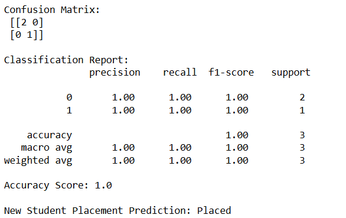

# Implementation-of-Logistic-Regression-Model-to-Predict-the-Placement-Status-of-Student

## AIM:
To write a program to implement the the Logistic Regression Model to Predict the Placement Status of Student.

## Equipments Required:
1. Hardware – PCs
2. Anaconda – Python 3.7 Installation / Jupyter notebook

## Algorithm
1. 
2. 
3. 
4. 

## Program:
```
import pandas as pd
import numpy as np
from sklearn.model_selection import train_test_split
from sklearn.preprocessing import StandardScaler
from sklearn.linear_model import LogisticRegression
from sklearn.metrics import classification_report, confusion_matrix, accuracy_score

# Step 1: Create a sample dataset
data = {
    'CGPA': [6.5, 7.2, 8.1, 5.9, 9.0, 7.5, 6.8, 8.5, 7.0, 6.2],
    'Internships': [1, 2, 2, 0, 3, 1, 1, 2, 0, 1],
    'Projects': [2, 3, 4, 1, 5, 3, 2, 4, 2, 1],
    'Placement': [0, 1, 1, 0, 1, 1, 0, 1, 0, 0]  # 1 = Placed, 0 = Not Placed
}
df = pd.DataFrame(data)

# Step 2: Define features and target
X = df[['CGPA', 'Internships', 'Projects']]
y = df['Placement']

# Step 3: Split into training and testing sets
X_train, X_test, y_train, y_test = train_test_split(
    X, y, test_size=0.3, random_state=42, stratify=y
)

# Step 4: Scale features
scaler = StandardScaler()
X_train_scaled = scaler.fit_transform(X_train)
X_test_scaled = scaler.transform(X_test)

# Step 5: Train Logistic Regression model
model = LogisticRegression()
model.fit(X_train_scaled, y_train)

# Step 6: Make predictions
y_pred = model.predict(X_test_scaled)

# Step 7: Evaluate model
print("Confusion Matrix:\n", confusion_matrix(y_test, y_pred))
print("\nClassification Report:\n", classification_report(y_test, y_pred))
print("Accuracy Score:", accuracy_score(y_test, y_pred))

# Step 8: Predict placement for a new student
new_student = pd.DataFrame([[7.8, 2, 3]], columns=['CGPA', 'Internships', 'Projects'])
new_student_scaled = scaler.transform(new_student)
placement_prediction = model.predict(new_student_scaled)

print("\nNew Student Placement Prediction:", "Placed" if placement_prediction[0] == 1 else "Not Placed")
```

## Output:



## Result:
Thus the program to implement the the Logistic Regression Model to Predict the Placement Status of Student is written and verified using python programming.
